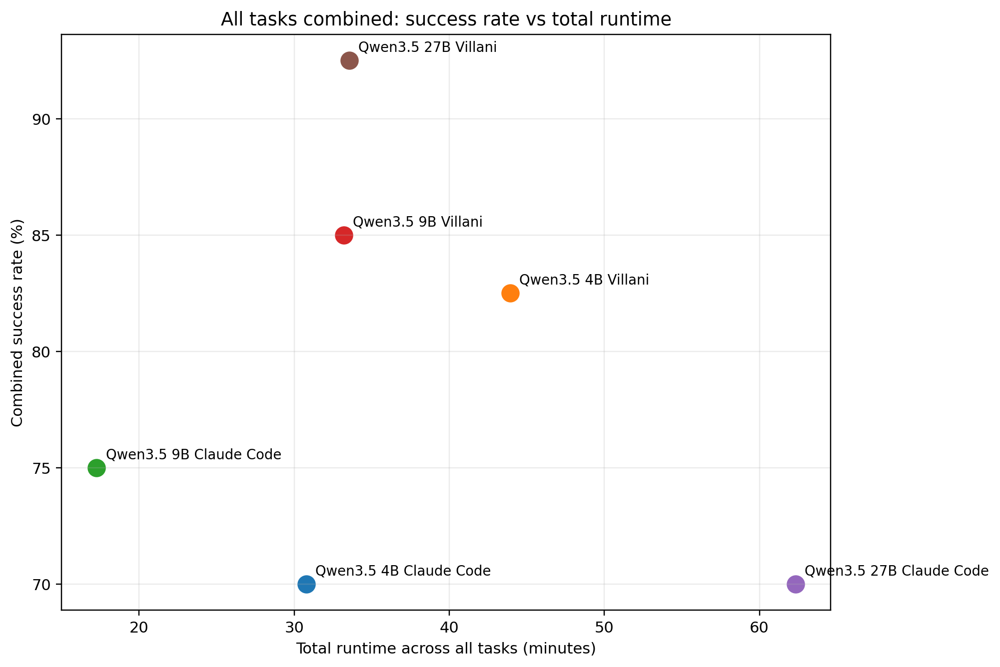
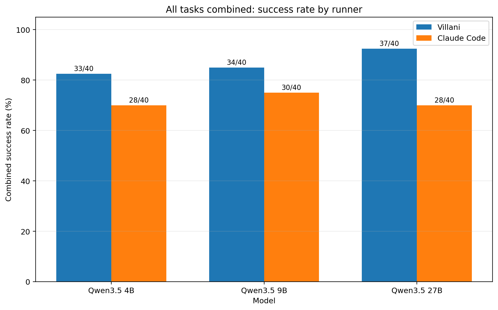
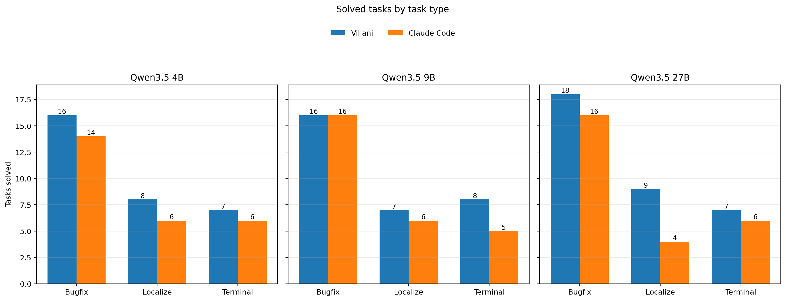

# Villani Code

**The runtime that forces small local models to do real repo work.**

Most coding agents look impressive right up until you take away the easy mode.

Give them a smaller local model, a bounded repo task, a hard verifier, and no frontier-model safety blanket, and the whole thing starts to wobble.

**Villani Code is built for that environment.**

It is a terminal-first coding agent runtime designed to get useful, verifiable work out of constrained local backends, not just produce a polished transcript and a hopeful diff.

On the benchmark runs in this repo, **Villani Code achieved the highest solve rate at every reported Qwen3.5 size: 4B, 9B, and 27B.** The strongest result is not just that it solves more. At **27B**, it also does it in substantially less total time than the baseline runner.



## The pitch

This is the uncomfortable gap in the coding-agent market:

Everyone wants the economics, privacy, and deployability of small local models.

Almost nobody has a runtime that makes those models perform like serious tools.

That is what Villani Code is trying to fix.

The bet is simple:

**Small models do not need more hype. They need a better runtime.**

A loose runtime wastes tokens, drifts across the repo, edits the wrong files, and dies in verification.

A tighter runtime can make the same class of model materially more useful.

That is the whole game.

## What the current benchmark says

Across the combined task set used in the current runs, Villani Code outperformed Claude Code at every tested Qwen3.5 size.

| Model | Villani | Claude Code |
|---|---:|---:|
| Qwen3.5 4B | **33/40 (82.5%)** | 28/40 (70.0%) |
| Qwen3.5 9B | **34/40 (85.0%)** | 30/40 (75.0%) |
| Qwen3.5 27B | **37/40 (92.5%)** | 28/40 (70.0%) |



That is the headline.

The more important point is what sits underneath it:

- **4B:** Villani solves more tasks, but usually takes longer to get there.
- **9B:** Villani still solves more, with a meaningful gap in useful work done.
- **27B:** Villani is better on both axes. Higher solve rate, lower total runtime.

That last result matters because it kills the easy dismissal.

This is not just “slower but a bit more thorough.”

At 27B, the runtime is shifting the frontier.

## Why this matters

Most agent benchmarks quietly reward the easiest operating conditions:

- strong hosted models
- huge context windows
- vague task definitions
- weak verification pressure
- workflows that hide failure behind long transcripts

That is not where the interesting product opportunity is.

The interesting opportunity is in making **smaller, cheaper, private models** do work that people would otherwise assume requires a much stronger backend.

If you can reliably pull useful repo work out of 4B to 30B-class local models, you get three things at once:

- lower inference cost
- better privacy posture
- a much wider deployment surface

That is a serious wedge.

## Where Villani is strongest

The current runs show that the gains are not randomly distributed.

Villani is especially strong on **bounded repo work** such as bug fixing, file localization, and terminal-centric tasks where the runtime can keep the model disciplined.



That split matters.

Anyone can get a model to look clever in an open-ended coding conversation.

The harder problem is getting it to:

- find the right area of the repo
- make a useful patch
- avoid unnecessary drift
- survive verification

That is where smaller models usually fall apart.

That is exactly where runtime design starts to matter.

## What Villani Code actually is

Villani Code is a terminal-first coding agent runtime for:

- bounded bug fixes
- repo navigation and localization
- test-guided patching
- constrained maintenance work
- local inference setups
- privacy-sensitive codebases

It is not trying to be an all-purpose autonomous software engineer.

It is trying to be something much more commercially useful:

**a system that turns underestimated local models into tools that can land real work.**

## What makes it different

### Built for constrained backends
Villani is designed around the failure modes of smaller models, not around the fantasy that every user has a frontier API on tap.

### Terminal first
It lives where coding work actually happens: files, diffs, commands, tests, verification, and repo state.

### Bounded and disciplined
The runtime is built to reduce drift, limit pointless wandering, and keep the model oriented toward a solvable patch.

### Verification-oriented
The target is not a nice conversation. The target is accepted work.

### Local-first by design
Villani fits environments where shipping private code to a hosted frontier provider is expensive, undesirable, or impossible.

## The thesis

**Model capability is not the whole story. Runtime quality moves the frontier too.**

That is the thesis behind Villani Code.

And the benchmark signal in this repo points in the same direction:

- same model family
- same size classes
- different runner
- materially different outcomes

That is not a branding trick.

That is the product.

## Where it should win

Villani Code is a strong fit when:

- code must stay local or private
- model cost matters
- tasks are bounded and verifier-friendly
- you want more useful work from smaller backends
- you care about limiting what the agent touches

## Where it is not trying to win

Villani Code is not trying to be:

- a generic chat shell with tools stapled on
- a frontier-model replacement for every problem
- a flashy demo optimized for open-ended conversations
- a claim that runtime matters more than model forever

That is not the point.

The point is narrower, and more valuable:

**with the right runtime, smaller local models become much harder to dismiss.**

## Quickstart

Install with TUI support:

```bash
pip install .[tui]
```

Headless CLI only:

```bash
pip install .
```

Development dependencies:

```bash
pip install .[dev]
```

Interactive session:

```bash
villani-code interactive --base-url http://127.0.0.1:1234 --model your-model --repo /path/to/repo
```

One-shot task:

```bash
villani-code run "Add retry handling to API client and update tests." --base-url http://127.0.0.1:1234 --model your-model --repo /path/to/repo
```

Autonomous pass:

```bash
villani-code --villani-mode --base-url http://127.0.0.1:1234 --model your-model --repo /path/to/repo
```
